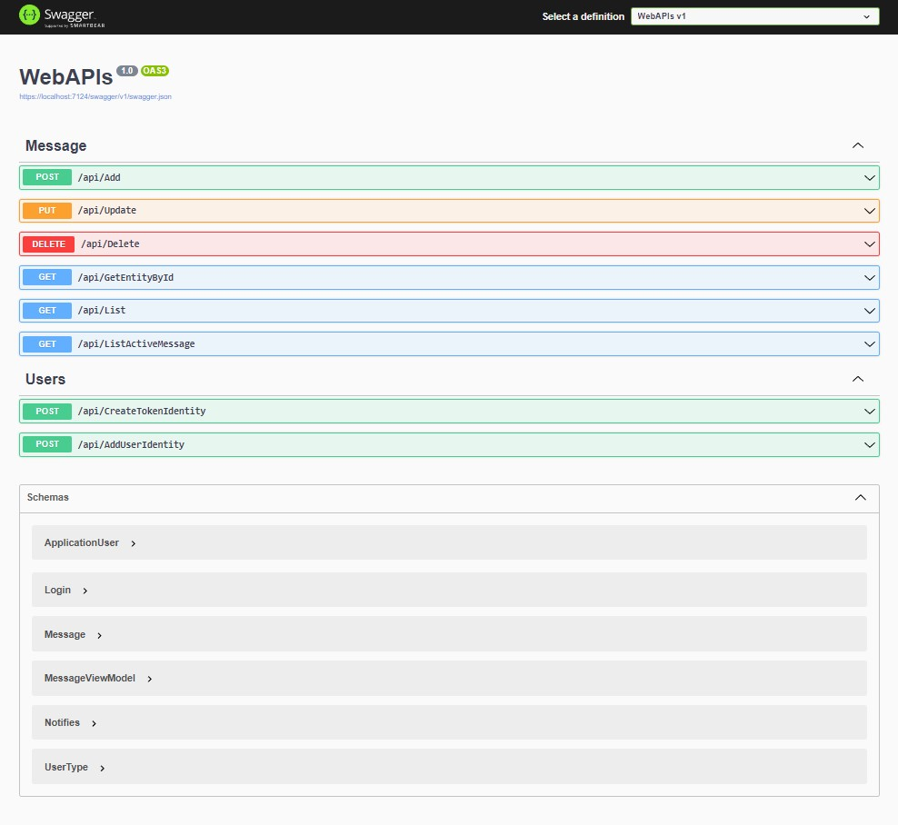

# Api message users


🚀 Em construção...

Aplicação sendo criada em .NetCore 6 usando Entity Framework e SqlServer para gerar um API que fornecerá o CRUD com validações de usuarios em mensagens enviadas.

## Tabela de conteúdos

- [Api message users](#api-message-users)
  - [Tabela de conteúdos](#tabela-de-conteúdos)
  - [Visão Geral](#visão-geral)
    - [O Projeto](#o-projeto)
    - [Captura de Tela](#captura-de-tela)
    - [Recursos utilizados](#recursos-utilizados)
  - [Pré-requisitos](#pré-requisitos)
    - [Inicialização da API](#inicialização-da-api)
  - [Autor](#autor)
  
## Visão Geral

### O Projeto

Aplicação back end criada em .NetCore 6 usando Entity Framework e SqlServer para gerar um API que fornecerá o CRUD com validações de usuários em mensagens enviadas.

Com esta API é possível realizar todas as operações comuns de um CRUD (create, read, update, delete) e validações necessárias para mensagens.

Para cadastrar um novo usuário será necessário enviar uma requisição `post` para o endpoint `https://localhost:7124/api/AddUserIdentity` e no body os dados para o novo usuário:

````json
{
  "email": "exemplo@exemplo.com.br",
  "password": "exemplo123456",
  "cpf": "123456789"
}
````

Para recebermos o JWT para usar nas autenticações precisamos enviar uma requisição `post` para o endpoint `https://localhost:7124/api/CreateTokenIdentity` passando pelo `body` e-mail e senha do usuário, exemplo:

````json
{
  "email": "exemplo@exemplo.com.br",
  "password": "exemplo123456"
}
````

E o retorno será o token para usar e todas a chamadas para Mensagem como `Authorization Bearer Token`.

### Captura de Tela



### Recursos utilizados

- [Asp.Net Core](https://learn.microsoft.com/pt-br/dotnet/core/introduction) - é uma plataforma de desenvolvedor multiplataforma de código aberto gratuita para criar muitos tipos de aplicativos.
- [Entity Framework](https://learn.microsoft.com/pt-br/ef/) - é um mapeador moderno de banco de dados de objeto para .NET.
- [Identity] - Gerencia usuários, senhas, dados de perfil, funções, declarações, tokens, confirmação de email e muito mais.
- [SQL Server](https://www.microsoft.com/pt-br/sql-server/) - banco de dados.

## Pré-requisitos

É necessário estar instalado:

- Visual Studio 2022
- Microsoft SQL Server 2019
  
### Inicialização da API

Após iniciarmos o Visual Studio 2022, devemos seguir as seguintes etapas para executar a API:

- Abrir o projeto contido na pasta **api-message-users**.

- Devemos encontrar o arquivo `appsettings.json` e alterarmos o `DefaultConnection` para a string de conexão correta do banco de dados instalado. A string tambm esta contida dentro deste caminho na função `GetConnectionString()` e alterado também `Infrastruture > Configuration > ContextBase.cs`
  
- Executar em linha de comando para montar o bando de dados através do Migration:
  - > add-migration Initial
  - > update-database
  
- Finalizada as etapas podemos executar a aplicação com WebAPIs como repositório de inicialização.

Assim será montado nossa API e exibida uma página do SwaggerUI mostrando os endpoints disponíveis.

## Autor

Portfólio - [danilocalegaro.dev.br](https://danilocalegaro.dev.br/)